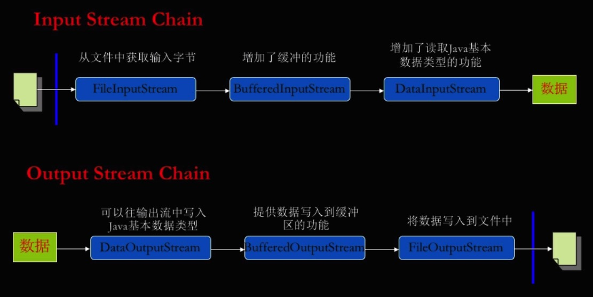

# 设计模式

## 创建型模式(creational)

## 结构型模式(structural)

### 装饰模式(Decorator)

> 又称包装( `Wrapper` )模式，装饰模式以`对客户端透明的方式动态`地给一个对象扩展更多功能，装饰模式`把客户端的调用委派到被装饰类`，是继承关系的一个替代方案。装饰模式在不必改变原类文件和使用继承的情况下，动态扩展对象的功能，通过创建一个包装对象，也就是装饰来包裹真实对象。

角色：

- 抽象构件角色( `Component `)：给出一个抽象接口，已规范准备接受附加责任的对象

- 具体构件角色( `Concrete Component` )：定义一个将要接受附加责任的类

- 装饰角色(`Decorator `)：持有一个构件( `Component`  )对象的引用,并定义一个与抽象构件接口一致的接口

- 具体装饰角色( `Concrete Decorator` )：负责给构件对象贴上附加的责任

应用场景

- JDK中IO流提供了一种链接机制，可以将一个流与另一个流首尾相接，形成一个流管道的连接，而这种机制利用了装饰模式。

## 行为型模式(behavioral)

