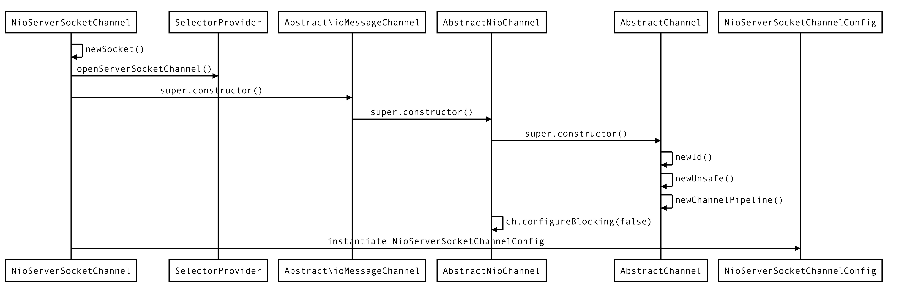

# Netty 服务端启动过程

## 1.准备

- `Netty版本：4.1.42.Final`

## 2. 服务端示例代码

```java
public class MySocketServer {

    public static void main(String[] args) throws InterruptedException {
        EventLoopGroup bossGroup = new NioEventLoopGroup(); // 创建 boss 线程组 用于服务端接受客户端的连接
        EventLoopGroup workerGroup = new NioEventLoopGroup(); // 创建 worker 线程组 用于进行 SocketChannel 的数据读写

        try {
            ServerBootstrap serverBootstrap = new ServerBootstrap(); // 创建 服务端启动类
            serverBootstrap.group(bossGroup, workerGroup).channel(NioServerSocketChannel.class)
              .handler(new LoggingHandler(LogLevel.INFO))
                    .childHandler(new MySocketServerInitializer());

          	// 绑定端口，并同步等待成功，即启动服务端
            ChannelFuture channelFuture = serverBootstrap.bind(8080).sync();
          	// 监听服务端关闭，并阻塞等待
            channelFuture.channel().closeFuture().sync();
        } finally {
          	// 优雅关闭两个 EventLoopGroup 对象
            bossGroup.shutdownGracefully();
            workerGroup.shutdownGracefully();
        }
    }
}
```

自定义  `Socket`  服务端初始化

```java
public class MySocketServerInitializer extends ChannelInitializer<SocketChannel> {

    @Override
    protected void initChannel(SocketChannel socketChannel) throws Exception {

        ChannelPipeline pipeline = socketChannel.pipeline();

        pipeline.addLast(new LengthFieldBasedFrameDecoder(Integer.MAX_VALUE, 0, 4, 0, 4));
        pipeline.addLast(new LengthFieldPrepender(4));
        pipeline.addLast(new StringDecoder(CharsetUtil.UTF_8));
        pipeline.addLast(new StringEncoder(CharsetUtil.UTF_8));
        pipeline.addLast(new MySocketServerHandler());
    }
}
```

自定义  `Socket`  服务端处理器

```java
public class MySocketServerHandler extends SimpleChannelInboundHandler<String> {

    @Override
    protected void channelRead0(ChannelHandlerContext channelHandlerContext, String msg) throws Exception {

        System.out.println(channelHandlerContext.channel().remoteAddress() + " : " + msg);
        channelHandlerContext.writeAndFlush("from server: " + UUID.randomUUID());
    }

    @Override
    public void exceptionCaught(ChannelHandlerContext ctx, Throwable cause) throws Exception {
        cause.printStackTrace();
        // 连接异常执行关闭连接操作
        ctx.close();
    }
}
```


## 3. 服务端启动分析

### 3.1 group

`#ServerBootstrap group(EventLoopGroup parentGroup, EventLoopGroup childGroup)` 方法，设置

```java
// ServerBootstrap
public ServerBootstrap group(EventLoopGroup parentGroup, EventLoopGroup childGroup) {
    super.group(parentGroup);
    ObjectUtil.checkNotNull(childGroup, "childGroup");
    if (this.childGroup != null) {
        throw new IllegalStateException("childGroup set already");
    }
    this.childGroup = childGroup; // 将传递进来的workerGroup赋值给ServerBootstrap内部的属性
    return this;
}
```

`#group(EventLoopGroup group)` 方法，将传递进来的  `bossGroup` 赋值给  `ServerBootstrap` 父类 `AbstractBootstrap` 中的属性，并调用 `#self()` 方法返回 `ServerBoostrap` 本身，从而实现**链式调用**。

```java
public B group(EventLoopGroup group) {
    ObjectUtil.checkNotNull(group, "group");
    if (this.group != null) {
        throw new IllegalStateException("group set already");
    }
    this.group = group;
    return self();
}
```

### 3.2 channel

`#channel(Class<? extends C> channelClass)` 方法，设置需要被实例化的 `channel` 类。

```java
public B channel(Class<? extends C> channelClass) {
    return channelFactory(new ReflectiveChannelFactory<C>(
            ObjectUtil.checkNotNull(channelClass, "channelClass")
    ));
}
```

- 可以看到传入的是 `channel` 类，里面会利用 `ReflectiveChannelFactory` 进行封装。

```java
public ReflectiveChannelFactory(Class<? extends T> clazz) {
    ObjectUtil.checkNotNull(clazz, "clazz");
    try {
        this.constructor = clazz.getConstructor(); // 将当前channel的构造方法赋值给成员变量
    } catch (NoSuchMethodException e) {
        throw new IllegalArgumentException("Class " + StringUtil.simpleClassName(clazz) +
                " does not have a public non-arg constructor", e);
    }
}
```

- 之后调用 `channelFactory(io.netty.channel.ChannelFactory<? extends C> channelFactory)` 方法设置 `channelFactory` 属性。
- 只有当调用 `#bind()` 方法时才会创建 `Channel` 实例。

```java
public B channelFactory(io.netty.channel.ChannelFactory<? extends C> channelFactory) {
    return channelFactory((ChannelFactory<C>) channelFactory);
}

public B channelFactory(ChannelFactory<? extends C> channelFactory) {
    ObjectUtil.checkNotNull(channelFactory, "channelFactory");
    if (this.channelFactory != null) {
      throw new IllegalStateException("channelFactory set already");
    }

    this.channelFactory = channelFactory;
    return self();
}
```

### 3.3 childHandler

`#childHandler(ChannelHandler childHandler)` 方法将传递进来的 `childHandler` 设置到 `ServerBootstrap` 的属性 `childHandler` 中。 

```java
public ServerBootstrap childHandler(ChannelHandler childHandler) {
    this.childHandler = ObjectUtil.checkNotNull(childHandler, "childHandler");
    return this;
}
```

### 3.4 bind

`#bind(int inetPort)` 方法，绑定端口，并启动服务器。

```java
public ChannelFuture bind(int inetPort) {
    return bind(new InetSocketAddress(inetPort));
}

public ChannelFuture bind(SocketAddress localAddress) {
    validate();
    return doBind(ObjectUtil.checkNotNull(localAddress, "localAddress"));
}
```

`#doBind(final SocketAddress localAddress)` 方法执行绑定操作。

```java
private ChannelFuture doBind(final SocketAddress localAddress) {
    final ChannelFuture regFuture = initAndRegister(); // 初始化和注册
    final Channel channel = regFuture.channel();
    if (regFuture.cause() != null) {
        return regFuture;
    }

    if (regFuture.isDone()) {
        // At this point we know that the registration was complete and successful.
        ChannelPromise promise = channel.newPromise();
        doBind0(regFuture, channel, localAddress, promise);
        return promise;
    } else {
        // Registration future is almost always fulfilled already, but just in case it's not.
        final PendingRegistrationPromise promise = new PendingRegistrationPromise(channel);
        regFuture.addListener(new ChannelFutureListener() {
            @Override
            public void operationComplete(ChannelFuture future) throws Exception {
                Throwable cause = future.cause();
                if (cause != null) {
                    // Registration on the EventLoop failed so fail the ChannelPromise directly to not cause an
                    // IllegalStateException once we try to access the EventLoop of the Channel.
                    promise.setFailure(cause);
                } else {
                    // Registration was successful, so set the correct executor to use.
                    // See https://github.com/netty/netty/issues/2586
                    promise.registered();

                    doBind0(regFuture, channel, localAddress, promise);
                }
            }
        });
        return promise;
    }
}
```

#### 3.4.1 initAndRegister

`#initAndRegister()` 方法执行初始化和注册。

```java
final ChannelFuture initAndRegister() {
    Channel channel = null;
    try {
        // 创建 Channel 对象(利用#channel()方法设置的channelFactory反射创建实例)
        channel = channelFactory.newChannel();
      	// 初始化 Channel 配置
        init(channel);
    } catch (Throwable t) {
        if (channel != null) {
            // channel can be null if newChannel crashed (eg SocketException("too many open files"))
            channel.unsafe().closeForcibly();
            // as the Channel is not registered yet we need to force the usage of the GlobalEventExecutor
            return new DefaultChannelPromise(channel, GlobalEventExecutor.INSTANCE).setFailure(t);
        }
        // as the Channel is not registered yet we need to force the usage of the GlobalEventExecutor
        return new DefaultChannelPromise(new FailedChannel(), GlobalEventExecutor.INSTANCE).setFailure(t);
    }

    // 注册 Channel 到 EventLoopGroup 中
    ChannelFuture regFuture = config().group().register(channel);
    if (regFuture.cause() != null) {
        if (channel.isRegistered()) {
            channel.close();
        } else {
            channel.unsafe().closeForcibly();
        }
    }
  
    return regFuture;
}
```

- 第 4 行：利用 `#channel()` 方法设置的 `channelFactory` 反射创建实例。
- 第 7 行：初始化 `Channel` 配置。
- 第 20 行：注册 `Channel` 到 `EventLoopGroup` 中。

##### 3.4.1.1 创建 Channel 对象

调用 `#newChannel` 方法创建实例，利用 `#channel()` 方法设置的 `channelFactory` 反射创建实例。

```java
// ReflectiveChannelFactory
@Override
public T newChannel() {
    try {
        return constructor.newInstance();
    } catch (Throwable t) {
        throw new ChannelException("Unable to create Channel from class " + constructor.getDeclaringClass(), t);
    }
}
```

调用 `NioServerSocketChannel` 默认无参构造创建对象。 



```java
// NioServerSocketChannel
public NioServerSocketChannel() {
    this(newSocket(DEFAULT_SELECTOR_PROVIDER));
}
```

```java
private static ServerSocketChannel newSocket(SelectorProvider provider) {
    try {
        /**
         *  Use the {@link SelectorProvider} to open {@link SocketChannel} and so remove condition in
         *  {@link SelectorProvider#provider()} which is called by each ServerSocketChannel.open() otherwise.
         *
         *  See <a href="https://github.com/netty/netty/issues/2308">#2308</a>.
         */
        return provider.openServerSocketChannel();
    } catch (IOException e) {
        throw new ChannelException(
                "Failed to open a server socket.", e);
    }
}
```

##### 3.4.1.2 初始化 Channel 配置

`#init(Channel channel)` 方法初始化 `Channel` 配置

```java
@Override
void init(Channel channel) {
    setChannelOptions(channel, options0().entrySet().toArray(newOptionArray(0)), logger);
    setAttributes(channel, attrs0().entrySet().toArray(newAttrArray(0)));

    ChannelPipeline p = channel.pipeline();

    final EventLoopGroup currentChildGroup = childGroup;
    final ChannelHandler currentChildHandler = childHandler;
    final Entry<ChannelOption<?>, Object>[] currentChildOptions =
            childOptions.entrySet().toArray(newOptionArray(0));
    final Entry<AttributeKey<?>, Object>[] currentChildAttrs = childAttrs.entrySet().toArray(newAttrArray(0));

    p.addLast(new ChannelInitializer<Channel>() {
        @Override
        public void initChannel(final Channel ch) {
            final ChannelPipeline pipeline = ch.pipeline();
            ChannelHandler handler = config.handler();
            if (handler != null) {
                pipeline.addLast(handler);
            }

            ch.eventLoop().execute(new Runnable() {
                @Override
                public void run() {
                    pipeline.addLast(new ServerBootstrapAcceptor(
                            ch, currentChildGroup, currentChildHandler, currentChildOptions, currentChildAttrs));
                }
            });
        }
    });
}
```

- 第 18-21 行，如果添加了针对 `BossGroup` 的处理器，将在这里添加到 `ChannelPipeline` 中。
- 第 26 行，  最后添加一个 `ServerBootstrapAcceptor` 处理器。

##### 3.4.1.3 注册 Channel 到 EventLoopGroup


